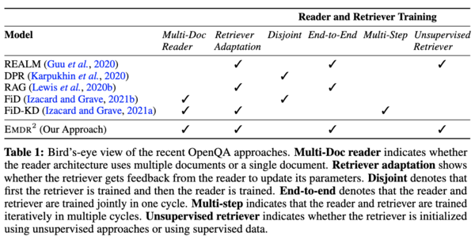
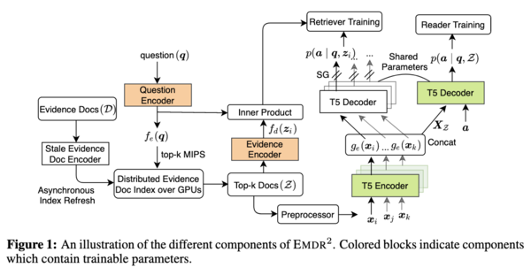
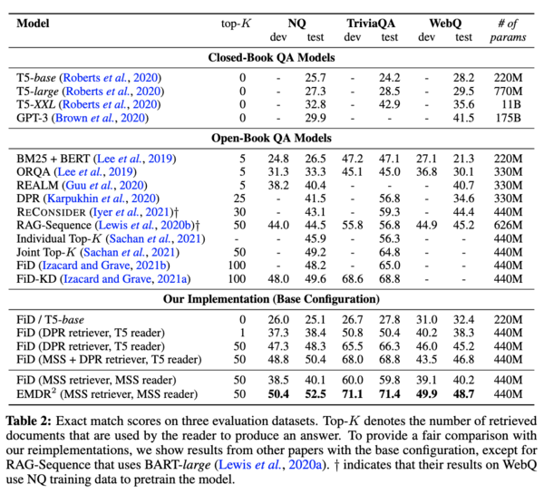

<a id="contents"></a>
# Contents
<!-- MarkdownTOC -->

- [Setup](#setup)
- [Downloading Data and Checkpoints](#downloading-data-and-checkpoints)
- [Usage](#usage)
- [Training](#training)
- [Issues](#issues)

<!-- /MarkdownTOC -->


[EMDR2](https://arxiv.org/abs/2106.05346) is an end-to-end training algorithm developed for the task of open-domain question answering. 


**Comparison with other approaches**
<p align="center">
  
</p>


**End-to-End Training**
<p align="center">
  
</p>


**Results**
<p align="center">
  
</p>


<a id="setup"></a>
# Setup

To use this repo, we recommend using one of [NGC's more recent PyTorch containers](https://catalog.ngc.nvidia.com/orgs/nvidia/containers/pytorch/tags). 
The image version used in this paper can be pulled with the command `docker pull nvcr.io/nvidia/pytorch:20.03-py3`. 

An installation of the [Nvidia container toolkit](https://docs.nvidia.com/datacenter/cloud-native/container-toolkit/install-guide.html#install-guide) may also be required.

There are additional dependencies that are needed to be installed. We have provided a Dockerfile for the same under the directory `docker`.
For instance, to build a new docker image (`nvcr.io/nvidia/pytorch:20.10-py3-faiss-compiled`) over the base container, please use this command
<pre>
cd docker
sudo docker build -t nvcr.io/nvidia/pytorch:20.10-py3-faiss-compiled .
</pre>

To run the above image in an interactive mode, please use this command
<pre>
sudo docker run --ipc=host --gpus all -it --rm -v /mnt/disks:/mnt/disks nvcr.io/nvidia/pytorch:20.10-py3-faiss-compiled bash
</pre>
, where `/mnt/disks` is the directory to be mounted.

<a id="downloading-data-and-checkpoints"></a>
## Downloading Data and Checkpoints
We've provided pretrained checkpoints and datasets on Dropbox for use to train models for dense retrieval and open-domain QA tasks. 
This data can be downloaded here:

Required training files
- [Wikipedia Evidence Documents from DPR paper](https://www.dropbox.com/s/bezryc9win2bha1/psgs_w100.tar.gz)
- [Indexed evidence documents and titles](https://www.dropbox.com/s/nc49dkno8o3pgb3/evidence-wikipedia-indexed-mmap.tar.gz)
- [Dataset-specific question-answer pairs](https://www.dropbox.com/s/gm0y3lx1wv0uxx2/qas.tar.gz)
- [BERT-large vocabulary file](https://www.dropbox.com/s/ttblv1uggd4cijt/bert-large-uncased-vocab.txt)

Required checkpoints and embeddings
- [Masked Salient Span (MSS) pre-trained retriver](https://www.dropbox.com/s/069xj395ftxv4hz/mss-emdr2-retriever-base-steps82k.tar.gz)
- [Masked Salient Span (MSS) pre-trained reader](https://www.dropbox.com/s/33lm2685ifpei4l/mss-emdr2-reader-base-steps82k.tar.gz)
- [Precomputed Evidence Index using MSS retriever](https://www.dropbox.com/s/y7rg8u41yavje0y/psgs_w100_emdr2-retriever-base-steps82k_full-wikipedia_base.pkl): This is a big file with 32 GB size.


<a id="usage"></a>
# Usage

We've provided several scripts for training models for both dense retriever and open-domain QA tasks in [`examples`](./examples) directory.

Please ensure to change the data and checkpoint paths in these scripts.

To replicate the answer generation results on the TriviaQA dataset, run the script as
```
bash examples/openqa/emdr2_trivia.sh
```
Similar scripts are provided for Natural Questions, WebQuestions and also for dense retriever.


<a id="training"></a>
# Training

For end-to-end training, we used a single node of 16 A100 GPUs with 40GB GPU memory.

In the codebase, the first set of 8 GPUs are used for model training, the second set of 8 GPUs are used for asynchronous evidence embedding, and all the 16 GPUs are used for online retrieval at every step. 
 
The code can also be run on a node with 8 GPUs by disabling asynchronous evidence embedding computation. However, this can lead to some loss in performance.

<a id="issues"></a>
# Issues

For any errors or bugs in the codebase, please either open a new issue or send an email to Devendra Singh Sachan (sachan.devendra@gmail.com) . 

# Citation

If you find this code useful, please consider citing our paper as:

```
@inproceedings{sachan2021endtoend,
    title={End-to-End Training of Multi-Document Reader and Retriever for Open-Domain Question Answering},
    author={Devendra Singh Sachan and Siva Reddy and William L. Hamilton and Chris Dyer and Dani Yogatama},
    booktitle={Advances in Neural Information Processing Systems},
    editor={A. Beygelzimer and Y. Dauphin and P. Liang and J. Wortman Vaughan},
    year={2021},
    url={https://openreview.net/forum?id=5KWmB6JePx}
}
```

Some of the ideas and implementations in this work were based on a previous paper. 
Please also consider citing the following paper, if the code is helpful.

```
@inproceedings{sachan-etal-2021-end,
    title = "End-to-End Training of Neural Retrievers for Open-Domain Question Answering",
    author = "Sachan, Devendra and Patwary, Mostofa and Shoeybi, Mohammad and Kant, Neel and Ping, Wei and Hamilton, William L. and Catanzaro, Bryan",
    booktitle = "Proceedings of the 59th Annual Meeting of the Association for Computational Linguistics and the 11th International Joint Conference on Natural Language Processing (Volume 1: Long Papers)",
    month = aug,
    year = "2021",
    address = "Online",
    publisher = "Association for Computational Linguistics",
    url = "https://aclanthology.org/2021.acl-long.519",
    doi = "10.18653/v1/2021.acl-long.519",
    pages = "6648--6662"
}
```

